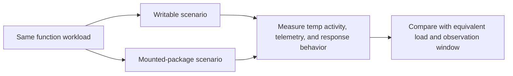

# Compare the scenarios

The source repository intentionally contrasts configuration choices that can affect local writes and telemetry volume. The scenario labels describe the purpose of the learning exercise, not a guarantee of a particular result for every function app.

## Source configuration comparison

| Concern | Writable learning scenario | Mounted-package learning scenario |
| --- | --- | --- |
| Deployment setting | `WEBSITE_RUN_FROM_PACKAGE=0` | `WEBSITE_RUN_FROM_PACKAGE=1` |
| App content behavior | Extracted application files are writable. | Package is mounted read-only. |
| Diagnostics | Detailed diagnostics enabled in the source setup. | Detailed diagnostics disabled in the source setup. |
| Default host log level | `Information` | `Warning` |
| Application Insights sampling | `100` percent in the source example. | `5` percent in the source example. |
| Other source tuning | Temp access is enabled and SCM separation is retained. | Temp access is disabled; the example adds health checks and pre-warmed instances. |

!!! warning
    Do not blindly transfer these app settings to a production workload. Logging, sampling, diagnostics, health checks, deployment methods, and SCM configuration are workload-specific trade-offs. Verify the setting's current support and behavior in Microsoft documentation before adopting it.

## Run a fair comparison

1. Use equivalent application code, dependency versions, regions, plans, and load profiles.
2. Change a small, documented set of settings between test groups.
3. Capture baseline disk, memory, CPU, latency, errors, and telemetry volume before load begins.
4. Apply sustained and burst workloads, including failure paths that create or abandon temporary data.
5. Compare behavior over an agreed observation window and record configuration, timestamps, and platform changes.
6. Review results with the application's reliability, security, and cost owners before promoting a pattern.

## Source implementation

- [Writable scenario guide](https://github.com/Cloud2BR-MSFTLearningHub/AzureFunctionApp-TempUsage/blob/main/scenario1-high-decay/README.md)
- [Mounted-package scenario guide](https://github.com/Cloud2BR-MSFTLearningHub/AzureFunctionApp-TempUsage/blob/main/scenario2-optimized/README.md)
- [Writable Terraform configuration](https://github.com/Cloud2BR-MSFTLearningHub/AzureFunctionApp-TempUsage/blob/main/scenario1-high-decay/terraform-infrastructure/main.tf)
- [Mounted-package Terraform configuration](https://github.com/Cloud2BR-MSFTLearningHub/AzureFunctionApp-TempUsage/blob/main/scenario2-optimized/terraform-infrastructure/main.tf)