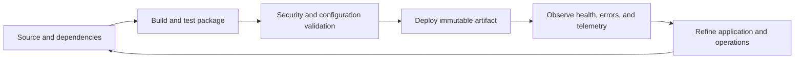

# Deploy and optimize

Reliable Function App operation comes from deliberate deployment packaging, useful telemetry, managed identities, dependency design, and a measured response to workload behavior. A mounted package is commonly a strong default for immutable application content, but it does not eliminate all temporary files or remove the need to monitor and clean up application-created artifacts.

## Deployment choices

| Practice | Why it helps |
| --- | --- |
| Build once and deploy a versioned artifact | Reduces deployment drift and makes rollback more deliberate. |
| Prefer run-from-package where it fits | Keeps deployed application content immutable and avoids extraction-based content writes. |
| Validate app settings per environment | Keeps connection endpoints, identities, logging, and feature flags explicit. |
| Use slots where supported and appropriate | Supports staged validation and controlled promotion. |
| Keep infrastructure definitions under review | Makes plan, identity, network, cost, and service changes visible before deployment. |

## Telemetry and temporary-file strategy

- Instrument meaningful business and reliability events, then tune log levels and sampling from an evidence-based baseline.
- Preserve enough unsampled or high-fidelity signal for errors, security events, and service-level objectives.
- Store logs and application data in supported durable destinations; do not depend on the temporary file system for retention.
- Keep runtime storage separate from business data where this improves access boundaries, lifecycle management, or blast-radius control.
- Use system-assigned managed identity and Key Vault references for secrets instead of embedding credentials in app settings or source.

## Production hardening

!!! danger
    The source Terraform examples include learning-oriented settings such as SQL firewall access for Azure services, soft-delete retention choices, and local execution through Azure CLI. A production implementation should review network isolation, private endpoints, Key Vault protection, RBAC, secret rotation, data retention, monitoring, backups, and provider-supported deployment practices.

## Source deployment material

- [Azure DevOps writable deployment template](https://github.com/Cloud2BR-MSFTLearningHub/AzureFunctionApp-TempUsage/blob/main/_deployment-options/az-functionapps-cicd-pipeline-template-writable.yml)
- [Azure DevOps optimized deployment template](https://github.com/Cloud2BR-MSFTLearningHub/AzureFunctionApp-TempUsage/blob/main/_deployment-options/az-functionapps-cicd-pipeline-template-optimized.yml)
- [Azure Functions deployment technologies](https://learn.microsoft.com/azure/azure-functions/functions-deployment-technologies)
- [Azure Functions reliability guidance](https://learn.microsoft.com/azure/azure-functions/functions-best-practices)