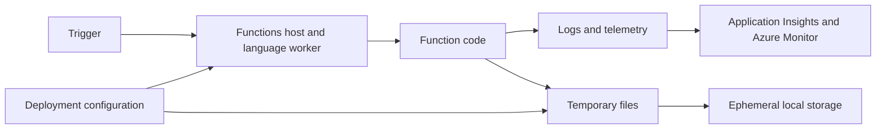

# Azure Function App Temp Usage

This learning hub explores how Azure Function Apps run on App Service infrastructure and how code, deployment choices, diagnostics, and workload behavior can influence temporary-file activity. The source repository contains two deliberately contrasting scenarios: a writable deployment with aggressive logging and a mounted-package deployment with reduced logging.

!!! warning
    Treat this as a controlled learning comparison, not a universal statement about Azure Functions cleanup or platform behavior. Validate current limits, storage semantics, observability requirements, workload patterns, and operational guidance in the official Azure documentation for your hosting plan and region.

  <a class="guide-card" href="runtime-and-temp-storage/"><strong>Runtime and temporary storage</strong>Understand the runtime layers, the distinction between app content and ephemeral local storage, and what to observe.</a>
  <a class="guide-card" href="compare-scenarios/"><strong>Compare the scenarios</strong>Review the source settings for writable and mounted-package experiments, then design a fair test.</a>
  <a class="guide-card" href="deploy-and-optimize/"><strong>Deploy and optimize</strong>Apply deployment, telemetry, identity, and operations practices appropriate to your workload.</a>

## Start here

| Need | Start with |
| --- | --- |
| Understand where temporary activity belongs in the runtime | [Runtime and temporary storage](runtime-and-temp-storage.md) |
| Reproduce the source comparison safely | [Compare the scenarios](compare-scenarios.md) |
| Improve an existing Function App deployment | [Deploy and optimize](deploy-and-optimize.md) |

## Source paths

- [Repository overview](https://github.com/Cloud2BR-MSFTLearningHub/AzureFunctionApp-TempUsage/blob/main/README.md)
- [High-decay scenario](https://github.com/Cloud2BR-MSFTLearningHub/AzureFunctionApp-TempUsage/tree/main/scenario1-high-decay)
- [Optimized scenario](https://github.com/Cloud2BR-MSFTLearningHub/AzureFunctionApp-TempUsage/tree/main/scenario2-optimized)
- [Deployment templates](https://github.com/Cloud2BR-MSFTLearningHub/AzureFunctionApp-TempUsage/tree/main/_deployment-options)
- [Editable Draw.io diagrams](https://github.com/Cloud2BR-MSFTLearningHub/AzureFunctionApp-TempUsage/tree/main/_docs)