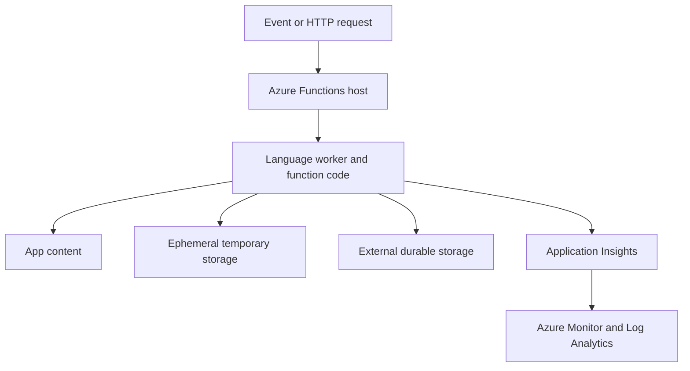

# Runtime and temporary storage

Azure Functions run within App Service infrastructure. A trigger invokes the Functions host and language runtime, which execute application code, interact with configured services, and emit telemetry. Temporary storage is an implementation detail of that runtime environment, not a durable data store or a substitute for an application data design.

## Storage roles

| Location or service | Intended role | Design implication |
| --- | --- | --- |
| App content | Deployed function binaries and configuration. | Prefer immutable deployment artifacts; do not use it as a mutable application data store. |
| Temporary local storage | Short-lived work files, platform buffers, and processing scratch space. | Assume it is ephemeral and capacity-constrained; clean up application-created files deterministically. |
| Azure Storage, SQL, or other managed data stores | Durable application data and outputs. | Define durability, retention, encryption, access, and lifecycle policies explicitly. |
| Application Insights and Log Analytics | Telemetry and investigation data. | Tune signal collection to preserve useful diagnostics without uncontrolled volume or cost. |

## What to monitor

- Function failures, latency, retries, and host health.
- Temporary-file creation made explicitly by the application, including error-path cleanup.
- File-system and process signals available for the selected hosting plan and environment.
- Telemetry volume, sampling, ingestion cost, and the correlation needed for incident investigation.
- Deployment events, configuration changes, scaling behavior, and downstream storage or dependency failures.

!!! note
    Local temporary paths and behavior vary by operating system, hosting plan, runtime version, and deployment model. Use [Azure Functions monitoring guidance](https://learn.microsoft.com/azure/azure-functions/configure-monitoring) and [App Service Kudu guidance](https://learn.microsoft.com/azure/app-service/resources-kudu) for the environment you actually run.

## Application design rules

1. Treat temporary files as disposable and clean up files your code creates in a `finally` path or equivalent.
2. Stream data when feasible rather than staging large payloads to local disk.
3. Send durable outputs to a service designed for persistence.
4. Avoid relying on restart behavior as a cleanup strategy.
5. Test under representative concurrency and failure conditions, not only a single successful invocation.